# a10r

[](LICENSE)
[](https://github.com/wilfriedroset/a10r/actions/workflows/ci.yml)
[](https://goreportcard.com/report/github.com/wilfriedroset/a10r)
[](https://github.com/wilfriedroset/a10r/releases/latest)

a10r is to Alertmanager what k9s is to Kubernetes — a fast,
terminal-native TUI for people who live in tmux and would rather
press `s` than click through a web UI to silence a flapping
alert.

Built for SREs, devs, and on-callers who want the alertmanager
day-to-day to feel like kubectl day-to-day.

## Demo

A ~90s tour — cold start, navigation, filtering, silencing, and
tenant switching:

[](https://asciinema.org/a/lyJ4hw26wpgNWtBV)

The two screens you live in: the alerts list and the silence form.

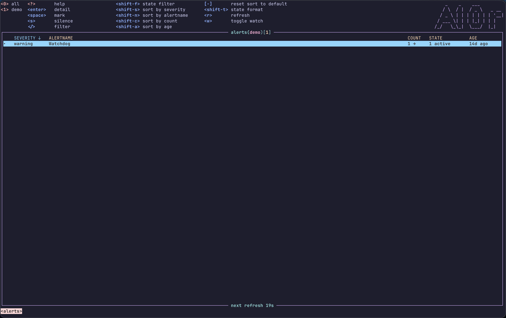

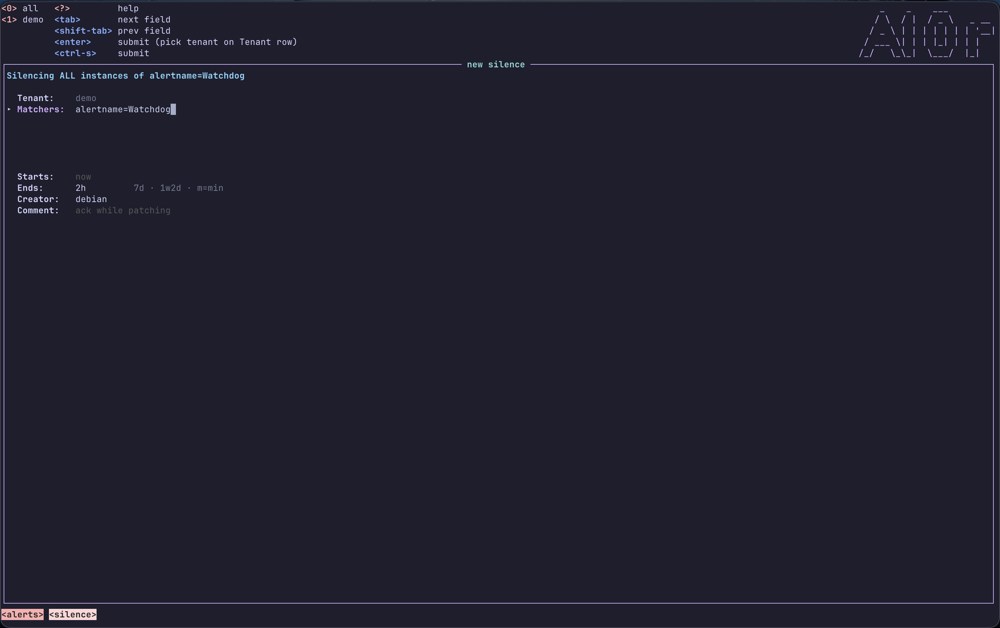

<details>
<summary>More screenshots</summary>

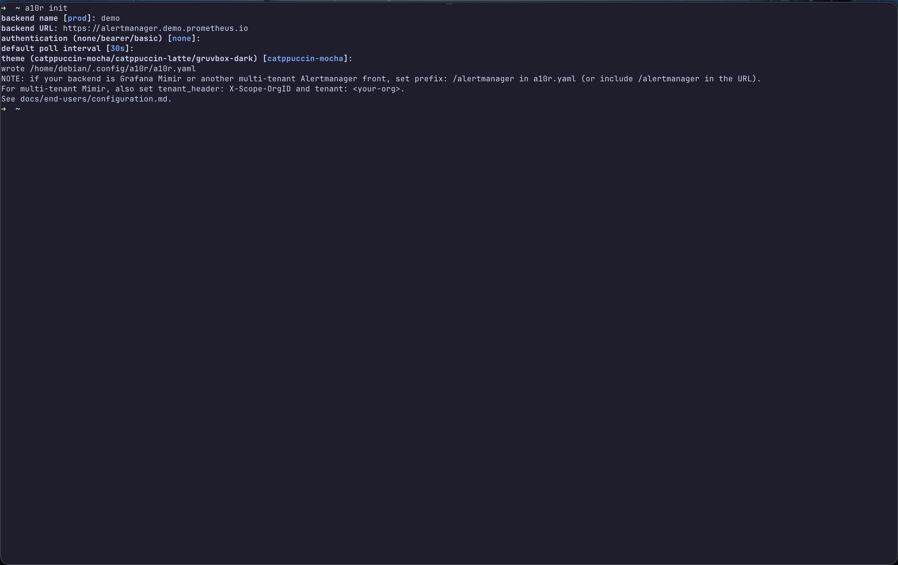

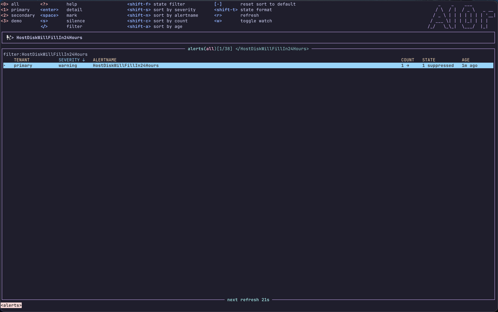

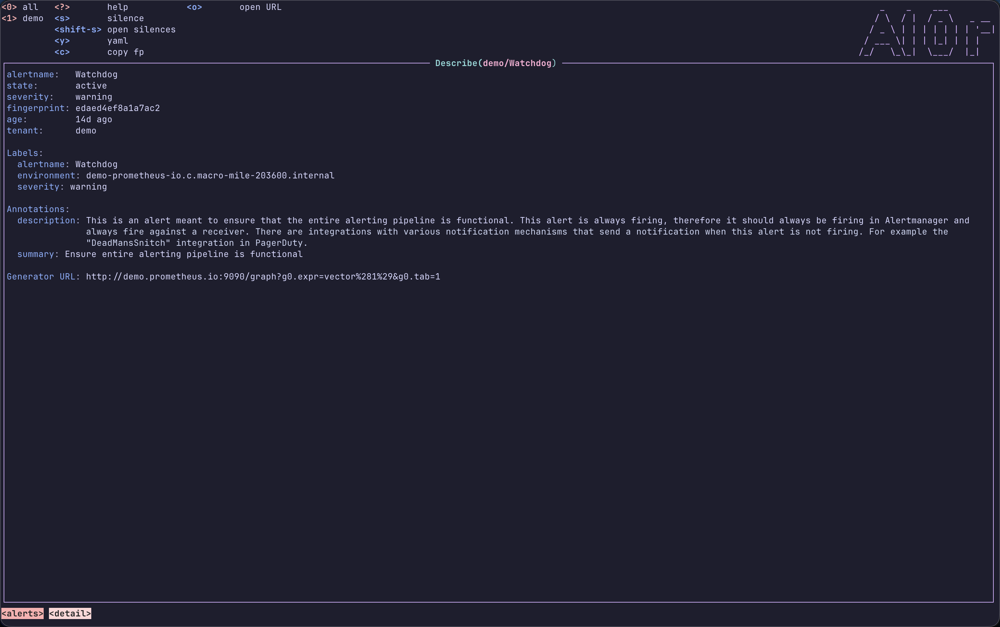

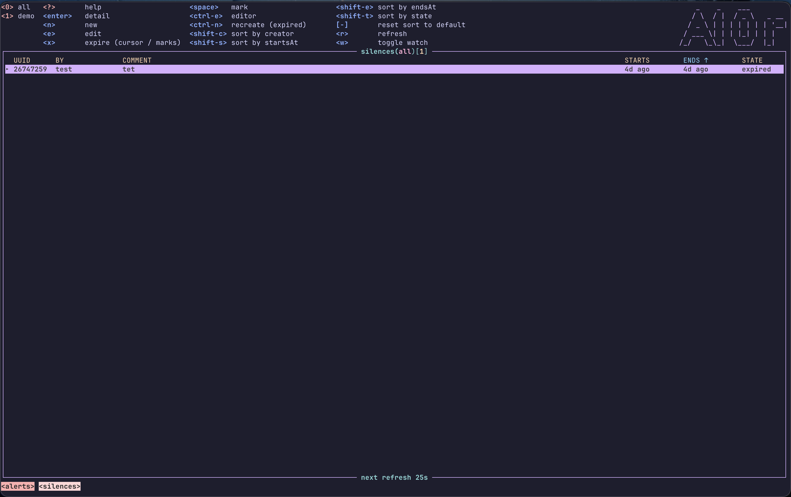

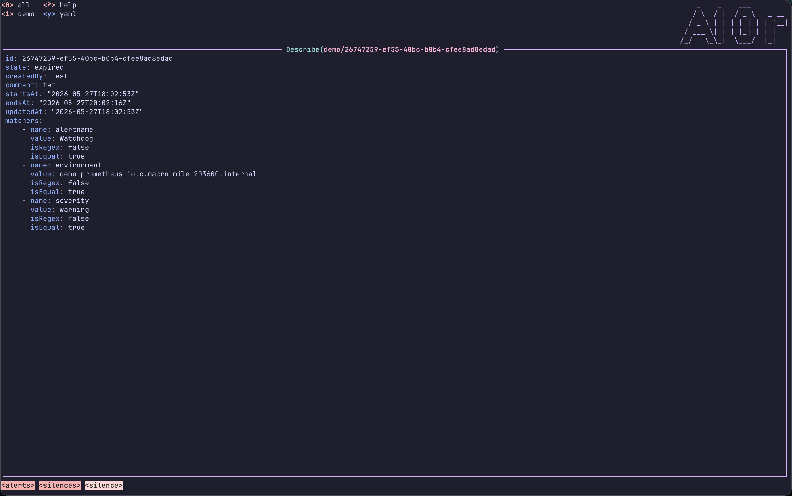

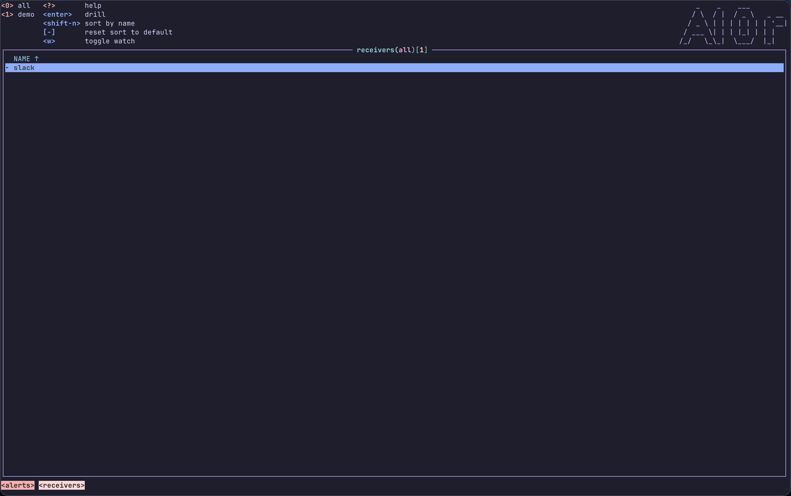

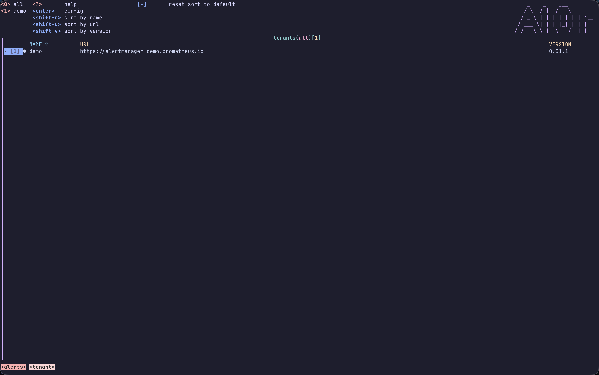

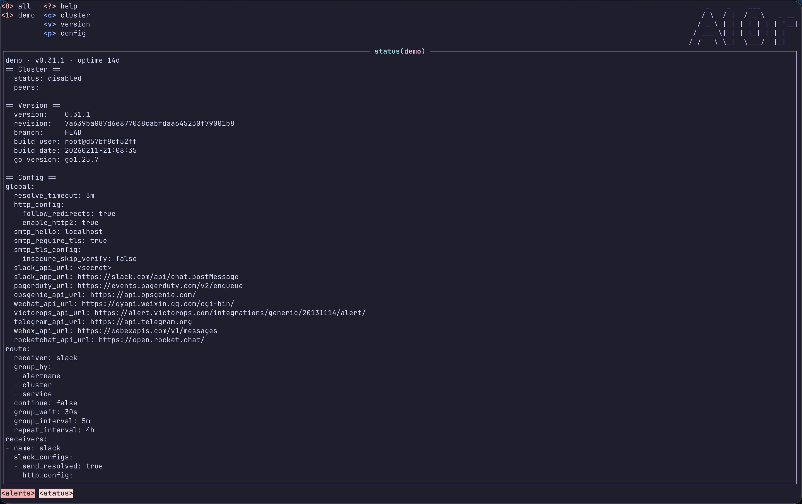

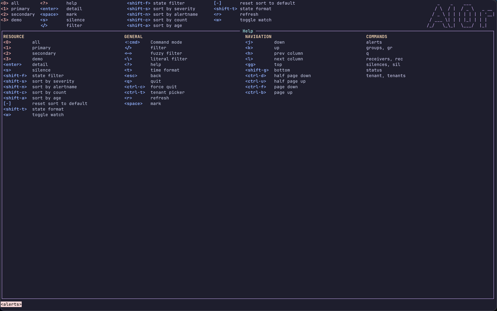

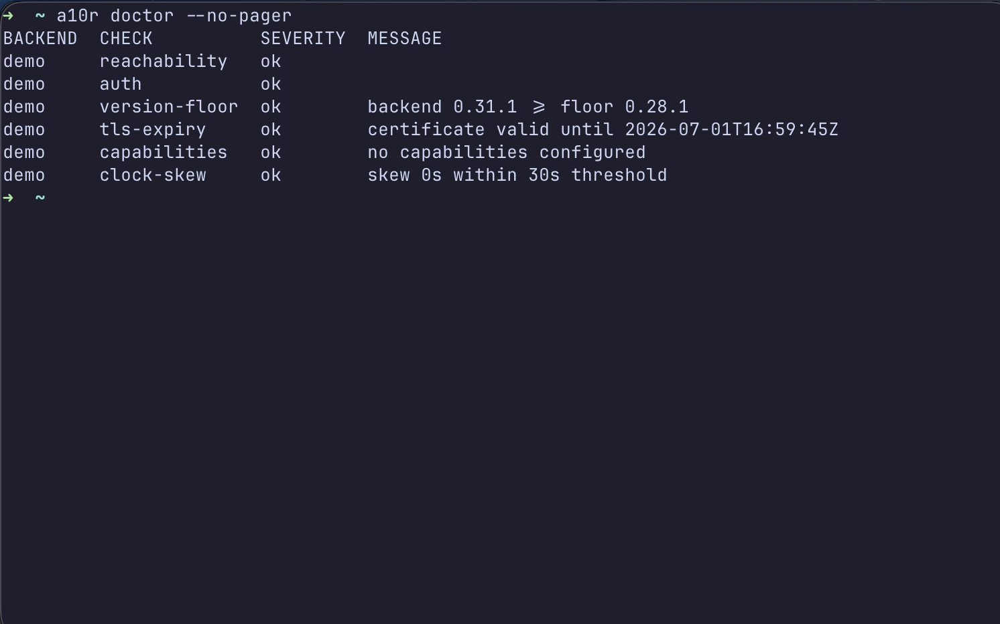

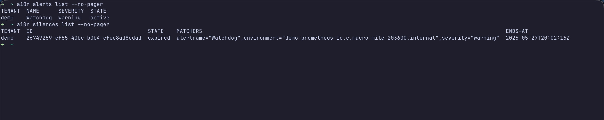

</details>

## Features

- **Alerts list** with vim motions, substring filter, sort-column
  walk, state-filter cycle, and a per-row severity column.
- **Silences list** sorted by `endsAt` ascending so soonest-
  expiring is at the top; full create / edit / expire bindings
  behind read-only mode.
- **Silence form** with multi-line matchers (`name=value`,
  `name=~regex`), RFC3339 / duration shorthand for time fields,
  and line-precise validation errors.
- **Status pane** showing cluster state, version info, and the
  raw `config.original` YAML with `c`/`v`/`p` anchor jumps.
- **Receivers** with Enter-to-drill into alerts filtered by
  receiver. **Alert groups** as a two-level tree with Tab to
  expand-all and `s` to silence-by-common-labels.
- **Tenant scope** for multi-backend setups: `0`/`1`-`9` switch
  scope globally, while the tenant picker modal (`Ctrl+T`) offers
  Space to toggle a tenant and `a` to select all.
- **Help overlay** (`?`) auto-built from the active action
  registry — read-only mode hides every Dangerous binding.
- **Bracketed paste** in `:` and `/` prompts, multi-byte rune
  handling on backspace, fuzzy-matched tenant picker.
- **External editor** handoff (`Ctrl+E` on a silence) via
  `tea.ExecProcess` honouring `$A10R_EDITOR` / `$EDITOR`.
- **Eight bundled catppuccin skins**: Frappe / Latte /
  Macchiato / Mocha plus each `-transparent` sibling, synced from
  `catppuccin/k9s`. Default is `catppuccin-mocha`. Any
  k9s skin works drop-in; user skins under `<config-dir>/skins/`
  shadow bundled by basename. See
  [ADR 0030](docs/adr/0030-in-tree-bundled-skins.md) for the
  bundled-skin policy and
  [`docs/contributor/skin-authoring.md`](docs/contributor/skin-authoring.md)
  for adding a bundled skin.
- **Two backends**: vanilla Alertmanager v2 (floor v0.28.1) and
  Grafana Mimir (v2.17+) via prefix + tenant header. Multi-tenant
  fan-out with bounded goroutine pool.

## Project status

a10r is a spare-time project, built for fun and experimentation.
Issues and PRs are reviewed when there's bandwidth — days,
sometimes weeks. Contributions are very welcome (see
CONTRIBUTING.md); the faster path to a feature is a
well-tested PR, not a feature request.

## Why a10r?

If you live in tmux, dislike clicking through the Alertmanager
web UI, and want fast vim-motion silencing across multiple
tenants, a10r is for you.

Prior art: [`pehlicd/amtui`][amtui] is another Alertmanager TUI
worth knowing about — a different shape (different aesthetic,
single-tenant focus). a10r exists because the multi-tenant +
k9s-aesthetic niche was unfilled.

## How a10r is built

a10r is built with agentic coding — a human maintainer driving
an LLM coding agent under a strict TDD loop with per-commit
subagent review. Every commit lands with tests for the happy
path and meaningful edge cases; no commit lands on `main`
without review.

The specific agent used at any given time is a maintainer
detail, recorded honestly in commit trailers. Today it's Claude
Code; tomorrow it might be something else.

## Install

### `go install`

```sh
go install github.com/wilfriedroset/a10r@v0.1.0
```

### Release binaries

Binary releases land on the [GitHub release page][rel] once the
v0.1.0 tag is pushed: Linux (amd64, arm64, armv7), FreeBSD (amd64,
arm64), Windows (amd64, arm64), and a single Darwin universal
tarball (amd64+arm64 merged), plus deb / rpm / apk packages for
linux amd64 / arm64 / arm. Release artifacts carry keyless build
provenance attestations (Sigstore via GitHub OIDC); verify with
`gh attestation verify <file> --repo wilfriedroset/a10r`.

### Docker

Multi-arch images (amd64, arm64) are published to the GitHub
Container Registry on each release:

```sh
docker run --rm -it \
  -v ~/.config/a10r:/home/nonroot/.config/a10r:ro \
  ghcr.io/wilfriedroset/a10r:latest
```

The image is distroless (`gcr.io/distroless/static`): no shell, runs
as a non-root user, and contains only the a10r binary plus CA
certificates and tzdata.

### Build from source

```sh
git clone https://github.com/wilfriedroset/a10r
cd a10r
make build      # produces ./a10r
docker build -t a10r .   # or as a container image
```

Requires Go (see `go.mod` for the toolchain floor).

## Quickstart

```sh
# 1. Run a10r — the first invocation prompts you for a backend
#    URL when no config exists.
a10r

# 2. Or pre-create a config:
mkdir -p ~/.config/a10r
cat > ~/.config/a10r/a10r.yaml <<EOF
backends:
  - name: prod
    url: https://alertmanager.example
EOF
a10r
```

Pass `-c <path>` (or `--config <path>`) to point at an explicit
config file instead of the XDG-resolved directory:

```sh
a10r -c examples/demo.yaml
```

`a10r validate <path>` exits 0 when the config parses cleanly,
with a line-precise error message otherwise.

`a10r info` prints the resolved config dir, log path, and the
backend list with capability flags.

## Keybindings

| Key | Action |
| --- | --- |
| `?` | Help overlay (auto-built from the active page's bindings) |
| `:` | Command bar (`:alerts`, `:silences`, `:sil`, `:status`, `:q`) |
| `/` | Filter prompt — substring match across labels and annotations |
| `j`/`k` or `Down`/`Up` | Cursor walk |
| `gg` / `G` | First / last row |
| `h` / `l` | Walk the sort column left / right |
| `Ctrl+D` / `Ctrl+U` | Half page down / up |
| `Ctrl+F` / `Ctrl+B` | Full page down / up (vim siblings of `Ctrl+D` / `Ctrl+U`) |
| `Space` | Mark / unmark a row (multi-select) |
| `Enter` | Drill into detail / open the selected row |
| `r` | Refresh the current page now |
| `w` | Toggle watch (auto-refresh) on the current page |
| `s` | Silence (alerts page; Dangerous, hidden in read-only) |
| `Shift+F` | Cycle the state filter: active → suppressed → unprocessed → all (alerts page) |
| `t` | Toggle timestamps between relative (`5m ago`) and absolute (ISO local) — app-wide |
| `Tab` | Expand / collapse all (groups page) |
| `Ctrl+T` | Tenant picker (multi-tenant deployments) |
| `0` | Scope: every configured tenant |
| `1` … `9` | Scope: nth tenant in `backends:` order |
| `Esc` | Dismiss modal / prompt; pop the page stack |
| `q` / `Ctrl+C` | Quit |

End-user cheat-sheet (per view) in [`docs/end-users/keybindings.md`](docs/end-users/keybindings.md). The keybinding contract — precedence stack, reserved keys, dangerous-action tagging — is recorded in [ADR 0043](docs/adr/0043-keybinding-contract.md).

## Configuration

See [`docs/end-users/configuration.md`](docs/end-users/configuration.md) for the full schema.

A minimal vanilla Alertmanager config:

```yaml
backends:
  - name: prod
    url: https://alertmanager.example
```

A Mimir config with one tenant. The schema mirrors Prometheus's
[`remote_write`](https://prometheus.io/docs/prometheus/latest/configuration/configuration/#remote_write)
block — paste a `remote_write` entry, change the `url:` path, and
you are done:

```yaml
backends:
  - name: mimir-prod
    url: https://mimir.example
    prefix: /alertmanager
    bearer_token: ${MIMIR_TOKEN}
    headers:
      X-Scope-OrgID: tenant-1
```

Environment variables in any string field are expanded via
`${VAR}` and `${VAR:-default}`.

## Documentation

- [`docs/end-users/quickstart.md`](docs/end-users/quickstart.md) — the 60-second tour.
- [`docs/end-users/cli.md`](docs/end-users/cli.md) — the headless command surface: read verbs and the silence lifecycle.
- [`docs/end-users/output-formats.md`](docs/end-users/output-formats.md) — `--output`, agent mode / `A10R_OUTPUT`, next-step hints, the error envelope, and `--dry-run` plans.
- [`docs/end-users/exit-codes.md`](docs/end-users/exit-codes.md) — the exit-code table CI/agent wrappers branch on.
- [`internal/skill/SKILL.md`](internal/skill/SKILL.md) — an agent skill teaching an AI assistant to drive a10r headless; install it with `a10r skills add` (or `a10r skills add --claude` for Claude Code).
- [`docs/end-users/keybindings.md`](docs/end-users/keybindings.md) — printable cheat-sheet per view.
- [`docs/end-users/configuration.md`](docs/end-users/configuration.md) — config schema, every field documented.
- [`docs/end-users/topology.md`](docs/end-users/topology.md) — which backends a10r supports, and why you point it at an Alertmanager rather than Prometheus / Loki / vmalert.
- [`docs/end-users/troubleshooting.md`](docs/end-users/troubleshooting.md) — common problems, diagnostic flags.
- [`CONTEXT.md`](CONTEXT.md) — the domain glossary: alerts, silences, tenants, the vocabulary the code speaks.
- [`ARCHITECTURE.md`](ARCHITECTURE.md) — package layout and the birth-of-a-page / birth-of-a-backend-call walkthroughs.
- [`docs/adr/`](docs/adr/) — architecture decision records: the decisions that shaped the implementation and why.
- [`docs/contributor/`](docs/contributor/) — contributor guides (skin authoring, review prompt).

## Contributing

See [`CONTRIBUTING.md`](CONTRIBUTING.md). The TL;DR is:

- Tests first. Every code commit ships with tests for the happy
  path and meaningful edge cases.
- One commit per logical unit. No WIP history; no fix-ups in
  follow-ups.
- `prek -a` must pass; `golangci-lint run ./...` must be clean;
  `go test -race ./...` must be green.
- DCO sign-off required (`git commit -s`).

## Acknowledgements

a10r exists because [k9s][k9s] showed the shape of the thing.
Where the design is good, the credit goes there; where it's bad,
that's on us. The skin schema is a deliberate drop-in of k9s's,
so your favourite k9s skin works here too.

Also standing on the shoulders of [Bubble Tea][bt],
[lipgloss][lg], [Catppuccin][cp], and the [Alertmanager][am] and
[Mimir][mimir] teams who built the systems we sit on top of.

## License

Apache 2.0. See [LICENSE](LICENSE).

[am]: https://github.com/prometheus/alertmanager
[mimir]: https://github.com/grafana/mimir
[k9s]: https://github.com/derailed/k9s
[bt]: https://github.com/charmbracelet/bubbletea
[lg]: https://github.com/charmbracelet/lipgloss
[cp]: https://github.com/catppuccin/catppuccin
[amtui]: https://github.com/pehlicd/amtui
[rel]: https://github.com/wilfriedroset/a10r/releases
